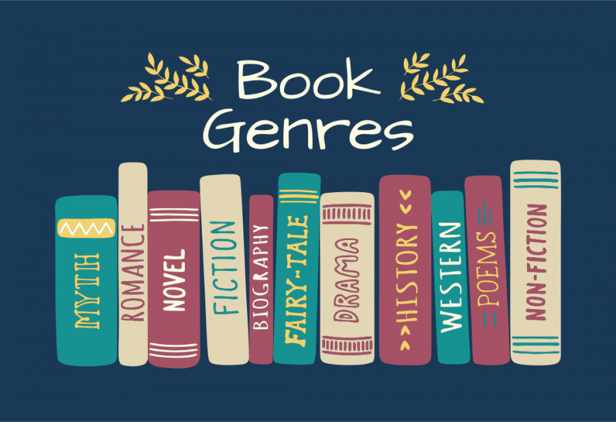
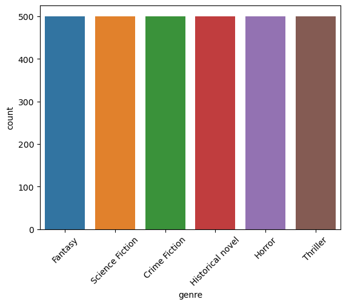
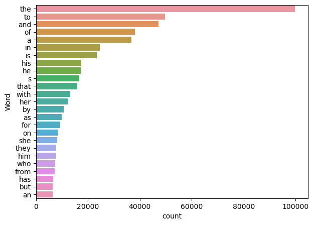
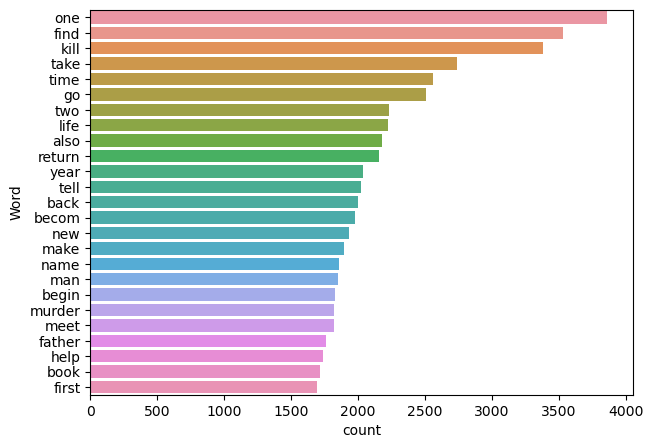

# Book Genre Classification

## Table of Content
* [Demo](#demo)
* [Overview](#overview)
* [Motivation](#motivation)
* [Problem Solving Steps](#problem-solving-steps)
* [Source of Dataset](#source-of-dataset)
* [Data Cleaning Techniques](#data-cleaning-techniques)
* [Exploratory Data Analysis](#exploratory-data-analysis)
* [Model Building](#model-building)
* [Model Performance](#model-performance)
* [Deployment](#deployment)
* [Future scope of project](#future-scope-of-project)

## Demo


https://github.com/lawalsegun2025/book_genre_classification/assets/94943377/75c24123-40fa-49fb-82f0-7bd38d787bad


## Overview

In the project, we built a model that is capable of predicting the genre of a book by its summary as;
 - Thriller
 - Science-Fiction
 - Crime Fiction
 - Fantasy
 - Horror </br></br>

<div align="center">
  
</div>

## Motivation

Book genres are simple classifications, allowing readers to know what kind of book they are reading. They also allow publishers to know what kind of book they are being asked to publish, so genre knowledge is an essential part of the querying process.

Genres are like the flavours of the literary world – they provide a way for readers to easily find books that will satisfy their particular cravings, whether it be for romance, fantasy, mystery, or any of the other countless flavours out there. They also help writers market their work to the right people, as each genre comes with an audience of fans who are primed to love your book!

This project will help readers to easily identify the book genres that is of interest to them.

## Problem Solving Steps

1. Load the data into a dataframe.
2. Perform Data Preprocessing like handling missing values, feature creation etc.
3. Perform Exploratory Data Analysis and ge valuable insights from the data.
4. Perform Feature Selection.
5. Build and select the model that best fits the data.
6. Save the model in a pickle file and integrate the model with the User Interface which will be made with Flask frame work
7. Deploy the model on a cloud service platform.


## Source of Dataset

The CMU Book Summary Dataset supports ongoing work described in:
                   
 David Bamman and Noah Smith (2013), "New Alignment Methods for Discriminative Book Summarization," [<a href="http://arxiv.org/abs/1305.1319">ArXiv</a>]

<a href="data/booksummaries.tar.gz">booksummaries.tar.gz</a> [17M]

This dataset contains plot summaries for 16,559 books extracted from Wikipedia, along with aligned metadata from Freebase, including book author, title, and genre. 

All data is released under a <a href="http://creativecommons.org/licenses/by-sa/3.0/us/legalcode">Creative Commons Attribution-ShareAlike License</a>. For questions or comments, please contact David Bamman (dbamman@cs.cmu.edu).</p>

## Data Cleaning Techniques

The following codes were used to preprocess the text data;

```python
# Write a function to clean the text
def clean_text(text):
    
    # remove the "\" sign
    text = re.sub("'\''","",text)
    
    # remove special symbols
    text = re.sub("[^a-zA-Z]", " ", text)
    
    # Remove white spaces
    text = " ".join(text.split())
    
    # Conevrt text to lowercase
    text = text.lower()
    
    return text

# remove stopwords 
def remove_stop_words(text):
    
    stop_words = set(stopwords.words("english"))

    removed_stop_word = [word for word in text.split() if word not in stop_words]
    
    return ' '.join(removed_stop_word)

# lemmatizing the text
def lemmatizing(text): 

    lemma = WordNetLemmatizer()

    text = text.split()
    
    # lemmatize
    text = [lemma.lemmatize(word) for word in text]
    
    return " ".join(text)

# stemming the text
def stemming(text):
    stemmer = PorterStemmer()

    text = text.split()
    
    # stem
    text = [stemmer.stem(word) for word in text]
    
    return " ".join(text)


```

## Exploratory Data Analysis

First we got a visual of the distribution of the genres in the dataset
</br></br>

<div align="center">
  
</div>

</br></br>
As it can be seen in the above plot, the this is a balanced labelled multi-class classification.

Before removing the stopwords, we analysed the most freequent words and below is the result we got
</br></br>

<div align="center">
  
</div>

</br></br>
We can see that before removing the stop words, the most common words are the, to, and, of etc. These words do not add so much meaning to the model.

Below is the plot of the most common words after removing the stopwords;
</br></br>

<div align="center">
  
</div>

</br></br>

We can now see that the most common words have changed after removing the stopwords. The most common words are; one, find, kill, take etc. These words adds more meaning to the model.


## Model Building

Three models were built in this project, these include
- Support Vector Classifier
- Multinomial Naive Bayes and
- RandomForestClassifier

The models were trained on text data that were vectorized using;
- Count Vectorizer and
- TF-IDF Vectorizer

## Model Performance

The models performed better when trained on data vectorized with TF-IDF. Below is a summary of the models results.

<div align="center">
 
 | Models   | Accuracy (Count Vetorizer) | Accuracy (TF-IDF Vectorizer) |
 | ---------| -------------------------- | ---------------------------- |
 | SVC      | 57%                        | 71%                          |
 | MN Bayes | 67%                        | 73%                          |
 | RF       | 61%                        | 63%                          |

</div>

All the models improved when the text data was vectorized using TF-IDF Vectorizer. Multinomial Naive Bayes was the best performing model. 

## Deployment

Model was deployed on Render.

